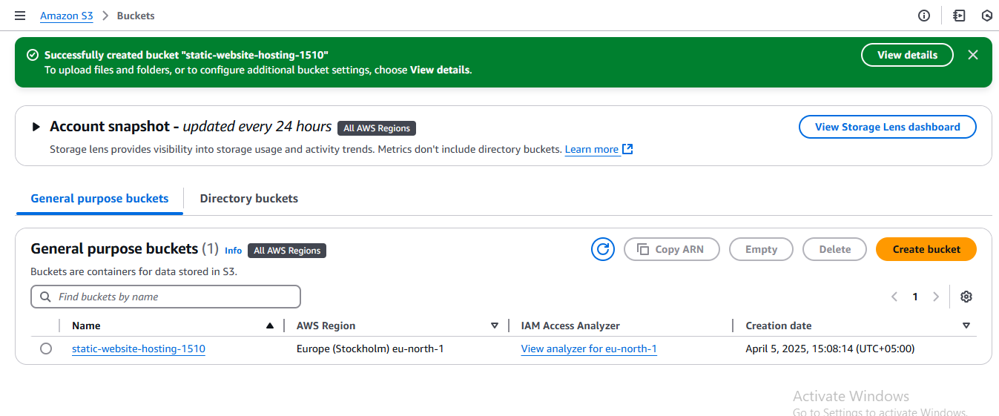
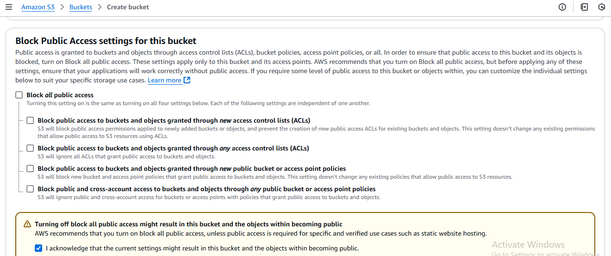
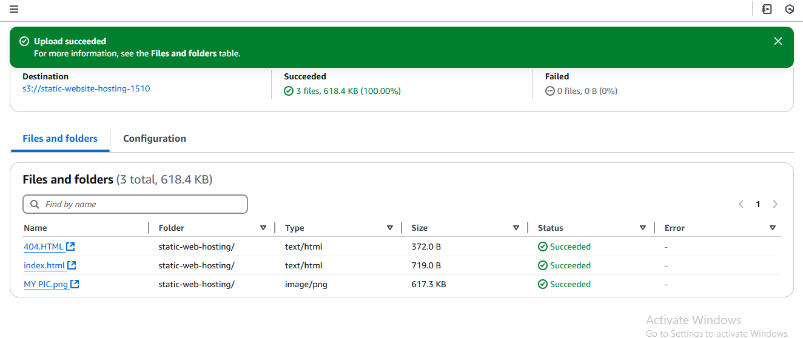
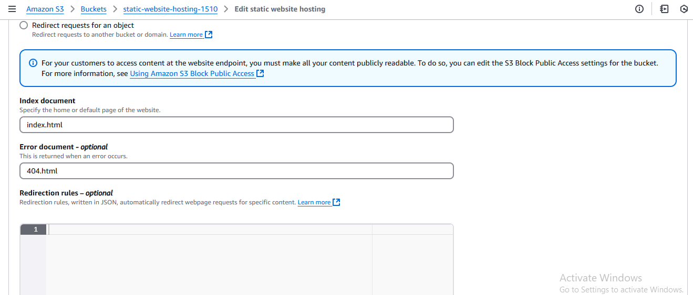
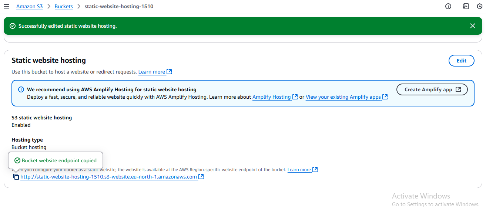
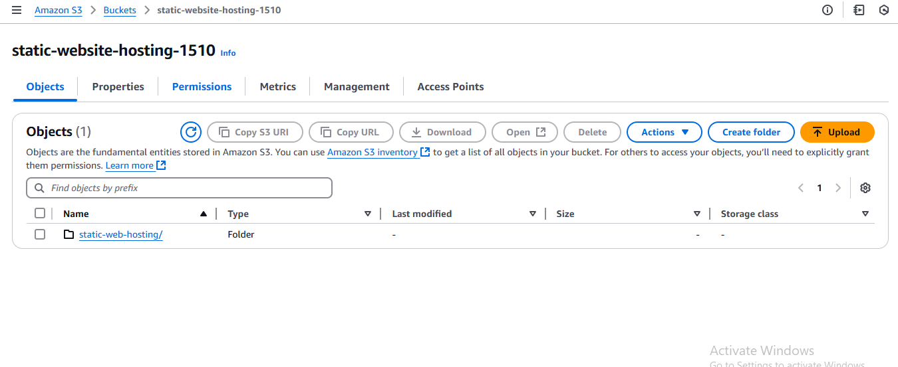
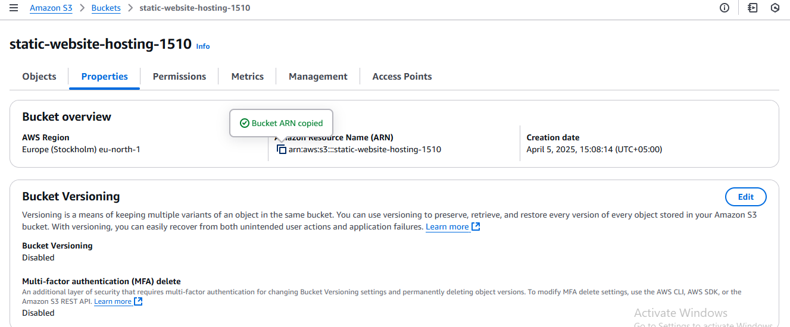
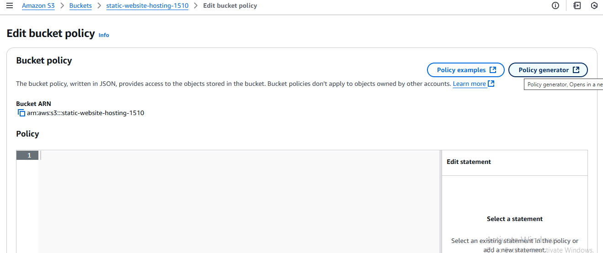
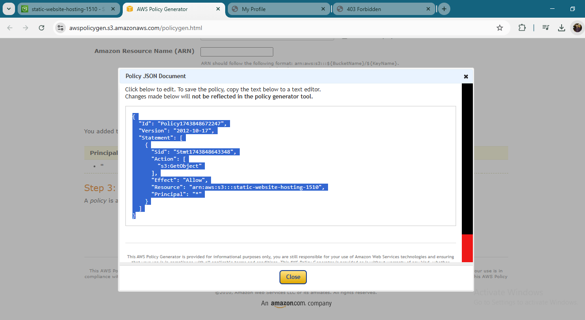
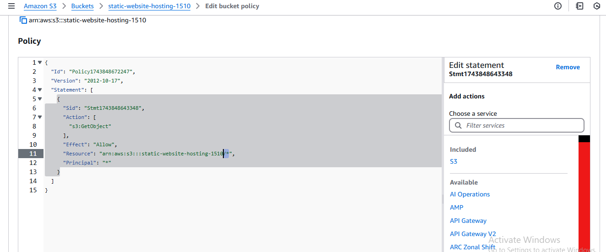

# 🌐 S3 Static Website Hosting

## 📖 Project Overview
This project demonstrates how to host a static website on **Amazon S3** using AWS services.  
With this setup, you can serve HTML and image files directly from an S3 bucket, making your website **scalable, cost-effective, and highly available**.

---

## 🛠️ Services Used
- **Amazon S3** → To store and host static website files (HTML and Images).

---

## 🚀 Steps to Implement

### 1. Create an S3 Bucket
- Go to **AWS Console → S3 → Create Bucket**.  
- Give it a unique name, for example: `static-website-hosting-1510`.  
- Choose the region closest to your audience.  

- **Uncheck** “Block all public access” (to make the website publicly available).  

- Upload your `index.html`, `404.html` (error file), and image files into the bucket.  

---

### 2. Enable Static Website Hosting
- Go to the **Properties** tab of the bucket.  

- Scroll to **Static website hosting → Enable**.  
- Select **Host a static website**.  
- Set `index.html` as the **Index Document**.  
- Set `404.html` as the **Error Document**.  

  

---

### 3. Copy the Website Endpoint
- After enabling hosting, copy the **Bucket Website Endpoint** (this is your site URL).  

- You might see an error — this happens because the bucket policy isn’t configured yet.  

---

### 4. Configure Bucket Policy
- Go to **Permissions → Bucket Policy**.  

- Use your **bucket ARN number** in the policy.  

- Open the **Policy Generator** to create a policy.  

  

- Apply the policy → Now public users can access your files.  

---

### 5. Verify the Website
- Open the bucket endpoint in a browser → your webpage is live!  

- Try visiting a missing page → you should see the error page.  

- Now both index and error pages are working correctly.  

- Final confirmation of website running.  

---

## 🎯 Benefits
- No servers to manage.  
- Highly scalable and durable.  
- Low-cost static site hosting.  

---

## 🧑‍💻 Key Learnings

### Amazon S3 Basics
- How to create and configure an S3 bucket.  
- Understanding bucket naming rules and region selection.  

### Static Website Hosting
- Enabling Static Website Hosting in S3.  
- Setting up `index.html` as the default root document.  
- Adding an error page (e.g., `404.html`) for better user experience.  

### Bucket Policy & Permissions
- Writing and applying an S3 bucket policy to allow public read access.  
- Understanding the difference between **Block Public Access** settings and bucket policies.  

### File Upload & Access
- Uploading website files to S3.  
- Accessing the website via the S3 website endpoint URL.  

### Security Considerations
- Limiting permissions only to necessary actions.  
- Understanding why **HTTPS is not supported** directly on S3 website endpoints, and how **CloudFront** can solve it.  

### Practical Cloud Skills
- Hands-on experience with AWS Management Console.  
- Realizing how cloud services can replace traditional web servers.  
